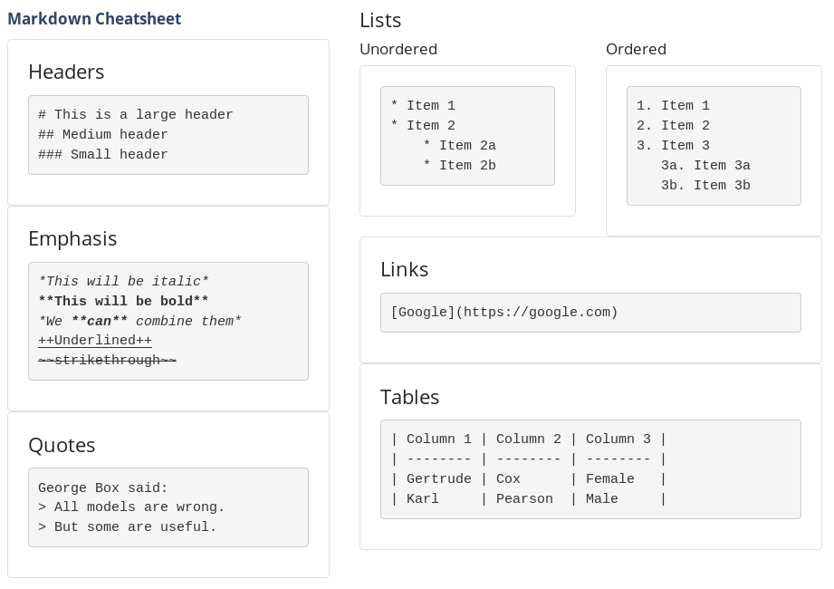
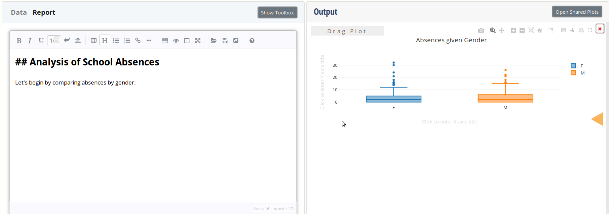
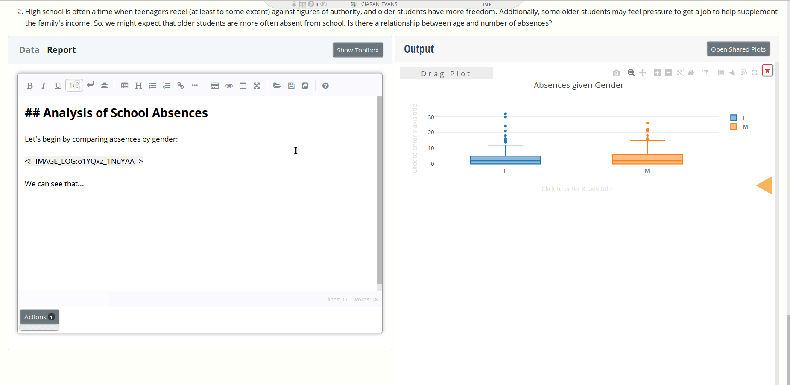

One tab that may be included in the Data Explorer is the report/editor tab. This allows you to write up a data analysis and include figures and tables. Several editor guides are available that walk you through how to use the editor and how to save your work. To access these guides, click the `?` symbol on the editor toolbar.

### Writing

To write your report, simply type in the window. To add emphasis (bold, italics), create headings, etc., the editor uses [Markdown](https://daringfireball.net/projects/markdown/). In Markdown, you just add a few symbols to your text to produce the desired effect. For example, `**hello**` gets turned into **hello** (the two asterisks on either side of the word make it bold). An introductory guide covering useful Markdown syntax can be found in the editor guides, by clicking the `?` symbol on the editor toolbar. The guide is also shown below:

### Including Figures and Tables

Using the data Toolbox, you can calculate summary statitics and create figures and tables. To include a plot in your report, drag the plot (see 'Drag Plot' in the top left of the plot) into the text of your report in the Report window. You can drag it into the location you want. When editing the text, your plot will appear in the text as something like

`<!--IMAGE_LOG:Qi2QBf_agQdog-->`

In the compiled report, this will be displayed as a plot. 

Similarly, you can drag tables into your report. They will appear as numbers separated by vertical bars (`|`), which will display as tables in the compiled report.

To ensure figures and tables display properly, please leave a blank line before and after each figure and table.

### Viewing the Compiled Report

To see what your compiled report looks like, you can use the **Preview** (eye symbol) and **Side by Side** buttons in the editor toolbar. 

### Saving Work

Your progress is stored in your browser window, so if you close the window or delete your browser cache, your work will be gone. Therefore, we recommend that you save your work to a markdown file, which can be opened later:
1. Click the **Save Report** icon in the editor toolbar 
2. Click **Export Markdown Source (to restore later)** and save

### Opening/Re-loading Files

To open a markdown file, click the **Open Markdown File** icon in the editor toolbar.

### Submitting Work

To submit to ISLE, click the **Submit** icon in the editor toolbar, then click the submit button that appears. Your instructor may also want you to submit a file to a course site (Canvas, Blackboard, Gradescope, etc.). If so, you can export a copy of your report as either an HTML file or PDF. To export, click **Save Report** then select **Export as HTML** or **Export as PDF**.
